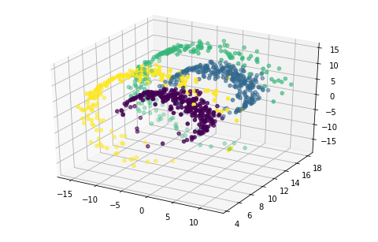
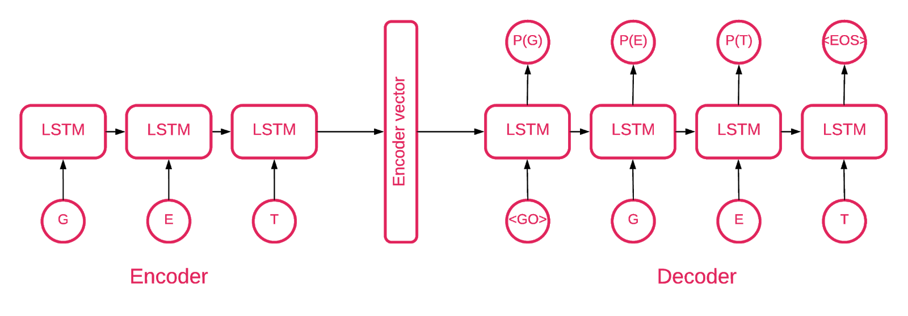
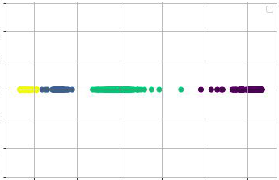

# RNN-Time-lagged-Autoencoder
Tensorflow 2.0 implementation of Time-lagged auto-encoder using Recurrent Neural Networks. Model was inspired by [Time-lagged autoencoders: Deep learning of slow collective variables for molecular kinetics](https://arxiv.org/abs/1710.11239)  (Christoph Wehmeyer & Frank Noé) 

We have a three-dimensional time series dataset. Data points in this time series can be grouped into 4 states (0,1,2,3), which can not be separated by simple geometric means. 




Our goal is to reduce dataset dimension from 3D to 1D, in such a way that the four different states are unraveled. We assume that in training set we have only observations, but not labels. 

To perform the tesk I've user modyfied idea of time-lagged autoencoder from original [paper](https://arxiv.org/abs/1710.11239). Instead of Dense Autoencoder, I've used RNN autoencoder to make use of the fact that given data is a time series.



The obtained results are surprisingly good, thanks to the nonlinear transformation I've managed to practically split all data into 4 separate clusters. The accuracy on a validation set (for validation we have both observations and label) is about 99.5%




## Getting Started

To run it You need jupyter notebook installed or You can run it using [google colab](https://colab.research.google.com)
The main file is RNN Time-lagged autoencoder.ipynb


### Prerequisites
```
-tensorflow 2.0
-numpy
-tqdm
-matplotlib
-sklearn
-mpl_toolkits
```


## Authors

* [tugot17](https://github.com/tugot17)


## License

This project is licensed under the MIT License - see the [LICENSE.md](LICENSE.md) file for details


